## AWS Cloud Overview

AWS is organized into geographic Regions, and each **Region** contains multiple **Availability Zones** (AZs). Each AZ consists of one or more distinct data centers with independent power, networking, and cooling.

The AZs within a Region are interconnected with high-bandwidth, low-latency networking, allowing them to function as a highly available cluster while still being isolated for fault tolerance.



## IAM: Users & Groups

IAM (Identity and Access Management) is a global AWS service used to control access to your AWS account. It manages users, groups, and roles. The root account is created by default but should never be shared or used for daily tasks.

Users represent people in your organization, and they can be organized into groups. Groups can contain users (but not other groups), and a user can belong to multiple groups.

## IAM: Permissions

IAM permissions are controlled through JSON policies attached to users or groups. These policies define what actions they’re allowed to perform. AWS recommends always following the principle of least privilege; grant only the minimum permissions needed.

## IAM: Policies Inheritance

IAM permissions are defined inside policies, and those policies can be attached either to a group or directly to a user. When a policy is attached to a group, every user in that group automatically inherits the permissions defined in that policy.

Most access in AWS is granted this way; through group-attached policies. A user’s effective permissions are the total set of permissions from all the policies attached to their groups, plus any policies attached directly to their individual user account.



## IAM: Policy Structure

An IAM policy is a JSON document that defines permissions in AWS. It always includes a version number and one or more statements. Each statement specifies whether something is allowed or denied, which actions it applies to, which resources it effects, and optional conditions for when the rule applies.

```json
{
  "Version": "2012-10-17", // Policy language version (always this value)
  "Id": "S3ReadOnlyPolicy", // Optional identifier for the policy
  "Statement": [
    {
      "Sid": "AllowReadAccess", // Optional identifier for this statement
      "Effect": "Allow", // Allow or Deny the actions
      "Principal": "*", // Who this rule applies to (used mostly in resource policies)
      "Action": [
        "s3:GetObject", // Allowed actions
        "s3:ListBucket"
      ],
      "Resource": [
        "arn:aws:s3:::my-example-bucket", // Bucket itself
        "arn:aws:s3:::my-example-bucket/*" // All objects inside the bucket
      ],
      "Condition": {
        // Optional conditions for when access is granted
        "IpAddress": {
          "aws:SourceIp": "203.0.113.0/24"
        }
      }
    }
  ]
}
```

### IAM Policy Fields

| Field         | Meaning                                                  |
| ------------- | -------------------------------------------------------- |
| **Version**   | The policy language version (always `"2012-10-17"`).     |
| **Id**        | Optional identifier for the policy.                      |
| **Statement** | One or more permission rules.                            |
| **Sid**       | Optional identifier for a specific statement.            |
| **Effect**    | Whether the statement allows or denies access.           |
| **Principal** | Who the policy applies to (mainly in resource policies). |
| **Action**    | AWS actions being allowed or denied.                     |
| **Resource**  | The AWS resources that the actions apply to.             |
| **Condition** | Optional conditions controlling when the rule applies.   |
