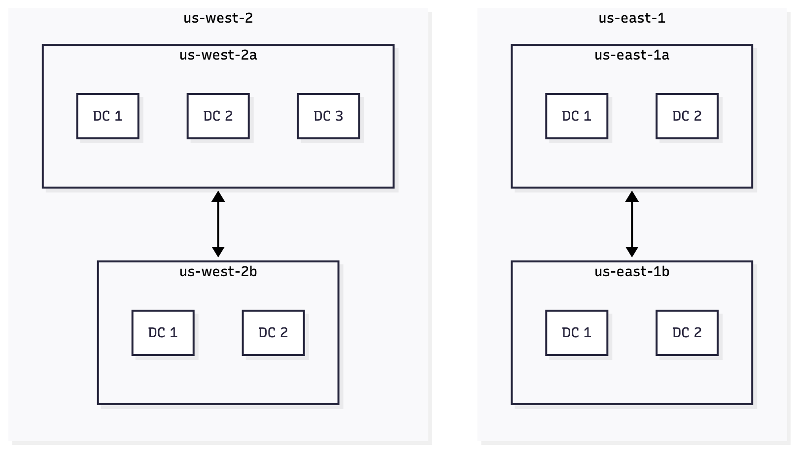

import Quiz from '@/components/ui/Quiz/Quiz.astro'
import { iamAndAwsCliQuiz } from './quizzes/iam-and-aws-cli'

## AWS Cloud Overview

AWS is organized into geographic Regions, and each **Region** contains multiple **Availability Zones** (AZs). Each AZ consists of one or more distinct data centers with independent power, networking, and cooling.

The AZs within a Region are interconnected with high-bandwidth, low-latency networking, allowing them to function as a highly available cluster while still being isolated for fault tolerance.



## IAM: Users & Groups

IAM (Identity and Access Management) is a global AWS service used to control access to your AWS account. It manages users, groups, and roles. The root account is created by default but should never be shared or used for daily tasks.

Users represent people in your organization, and they can be organized into groups. Groups can contain users (but not other groups), and a user can belong to multiple groups.

## IAM: Permissions

IAM permissions are controlled through JSON policies attached to users or groups. These policies define what actions they’re allowed to perform. AWS recommends always following the principle of least privilege; grant only the minimum permissions needed.

## IAM: Policies Inheritance

IAM permissions are defined inside policies, and those policies can be attached either to a group or directly to a user. When a policy is attached to a group, every user in that group automatically inherits the permissions defined in that policy.

Most access in AWS is granted this way; through group-attached policies. A user’s effective permissions are the total set of permissions from all the policies attached to their groups, plus any policies attached directly to their individual user account.
src/content/posts/


## IAM: Policy Structure

An IAM policy is a JSON document that defines permissions in AWS. It always includes a version number and one or more statements. Each statement specifies whether something is allowed or denied, which actions it applies to, which resources it effects, and optional conditions for when the rule applies.

```json
{
  "Version": "2012-10-17", // Policy language version (always this value)
  "Id": "S3ReadOnlyPolicy", // Optional identifier for the policy
  "Statement": [
    {
      "Sid": "AllowReadAccess", // Optional identifier for this statement
      "Effect": "Allow", // Allow or Deny the actions
      "Principal": "*", // Who this rule applies to (used mostly in resource policies)
      "Action": [
        "s3:GetObject", // Allowed actions
        "s3:ListBucket"
      ],
      "Resource": [
        "arn:aws:s3:::my-example-bucket", // Bucket itself
        "arn:aws:s3:::my-example-bucket/*" // All objects inside the bucket
      ],
      "Condition": {
        // Optional conditions for when access is granted
        "IpAddress": {
          "aws:SourceIp": "203.0.113.0/24"
        }
      }
    }
  ]
}
```

### IAM Policy Fields

| Field         | Meaning                                                  |
| ------------- | -------------------------------------------------------- |
| **Version**   | The policy language version (always `"2012-10-17"`).     |
| **Id**        | Optional identifier for the policy.                      |
| **Statement** | One or more permission rules.                            |
| **Sid**       | Optional identifier for a specific statement.            |
| **Effect**    | Whether the statement allows or denies access.           |
| **Principal** | Who the policy applies to (mainly in resource policies). |
| **Action**    | AWS actions being allowed or denied.                     |
| **Resource**  | The AWS resources that the actions apply to.             |
| **Condition** | Optional conditions controlling when the rule applies.   |

## IAM: Password Policy

AWS recommends enforcing strong IAM password policies to protect every account. Set a healthy minimum length, require a mix of uppercase, lowercase, numbers, and symbols, allow users to rotate their own passwords, force periodic expirations, and prevent reuse so stale credentials can’t be recycled.

## IAM: Multi-Factor Authentication (MFA)

Enable MFA on root accounts and IAM users so a password alone is never enough. MFA pairs something you know (the password) with something you have (a hardware token or authenticator app), so even if the password leaks, the account stays protected.

AWS supports both virtual MFA apps and hardware key fobs (including specialized devices for GovCloud), letting you choose the factor that fits your environment.

## Accessing AWS: Console, CLI, and SDKs

You can interact with AWS through the Management Console (protected by password + MFA), the AWS Command Line Interface, or one of the AWS SDKs. Both the CLI and SDKs authenticate using **access keys** (Access Key ID + Secret Access Key), which function like a username/password pair for programmatic access. Each IAM user manages their own keys—treat them as secrets and rotate or retire them when no longer needed.

## AWS SDKs

AWS SDKs are language-specific libraries (JavaScript, Python/Boto3, Java, C#, Go, etc.) plus mobile and IoT variants that let your application call AWS services programmatically. The AWS CLI itself is built on top of the Python SDK. Use an SDK when you want tighter integration with your codebase instead of scripting against the CLI or clicking in the console.

## IAM Roles for AWS Services

AWS services often need to call other services on your behalf. Instead of hard-coding keys, you assign an IAM role to the service (for example an EC2 instance profile, a Lambda execution role, or a CloudFormation service role). The role’s policies define what that service is allowed to do, keeping credentials off disk while still granting the permissions it needs.

## IAM Security Tools

Two built-in tools help you audit IAM usage:

- **IAM Credentials Report** (account-level): lists every IAM user and whether their password, access keys, and MFA are enabled or unused.
- **IAM Access Advisor** (user-level): shows which AWS services a user can access and the last time each service was used, so you can prune stale permissions.

## IAM Guidelines & Best Practices

- Reserve the root account for initial setup only.
- Give each person a unique IAM user, place users into groups, and attach permissions to the groups.
- Enforce strong password policies and MFA everywhere.
- Use IAM roles to give AWS services the access they need instead of embedding keys.
- Use access keys only for programmatic (CLI/SDK) access and rotate them regularly.
- Audit your environment with IAM Credentials Reports and Access Advisor.
- Never share IAM users or access keys—create dedicated identities instead.

## IAM Section Summary

Everything in this module builds toward securing and automating access:

- Create separate IAM users (group them for permissions) and write JSON policies to control what they can do.
- Assign IAM roles to AWS services (EC2, Lambda, etc.) so they can act on your behalf without shared keys.
- Lock down each identity with strong password policies + MFA.
- Use the AWS CLI or SDKs with access keys for programmatic work.
- Continually audit with IAM Credential Reports and Access Advisor to trim unused access.

## Test your knowledge

<Quiz {...iamAndAwsCliQuiz} randomizeQuestions randomizeOptions />
